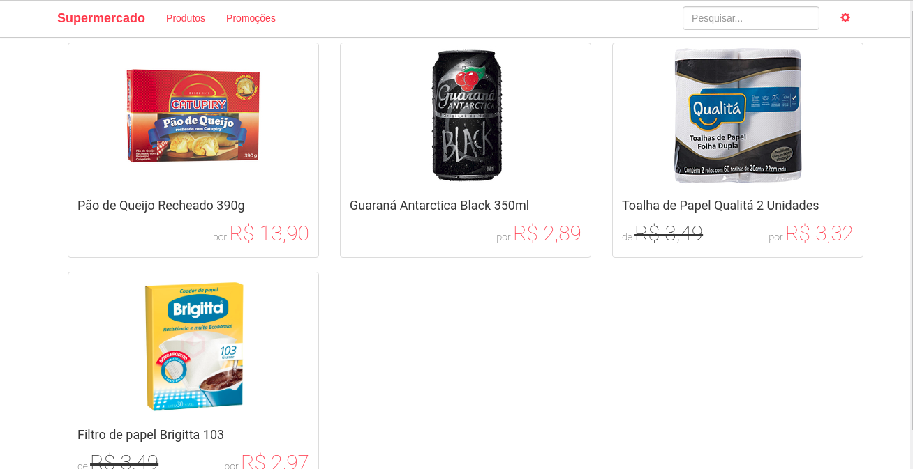
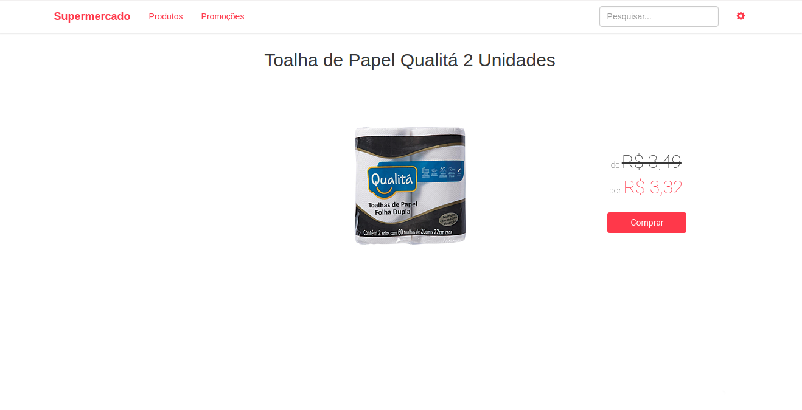

> Description in english below
 
# Supermercado
Pequeno supermercado feito em `Angular 2` utilizando `InMemoryDataService`. Inclui as operações criar, ler, atualizar e excluir produtos (CRUD), além de validar os dados.

## Screenshots





## Pré requisitos
- [Nodejs](http://nodejs.org/) - Versão 6.9.4+

## Instalação
- Instale os componentes do Nodejs
```
npm install
```
 
- Compile e execute o código
```
npm run tsc
npm run lite
```

- Ou fazendo isto em apenas um passo
```
npm start
```

# Supermercado (Supermarket)
Small supermarket made with `Angular 2` and `InMemoryDataService`. Include create, read, update, and delete operations (CRUD) also has a data validation.

## Screenshots


## Pre requisites
- [Nodejs](http://nodejs.org/) - Version 6.9.4+

## Installation
- Install Nodejs components
```
npm install
```
 
- Compile and execute the code
```
npm run tsc
npm run lite
```

- Or doing it in one-step
```
npm start
```
 
 
